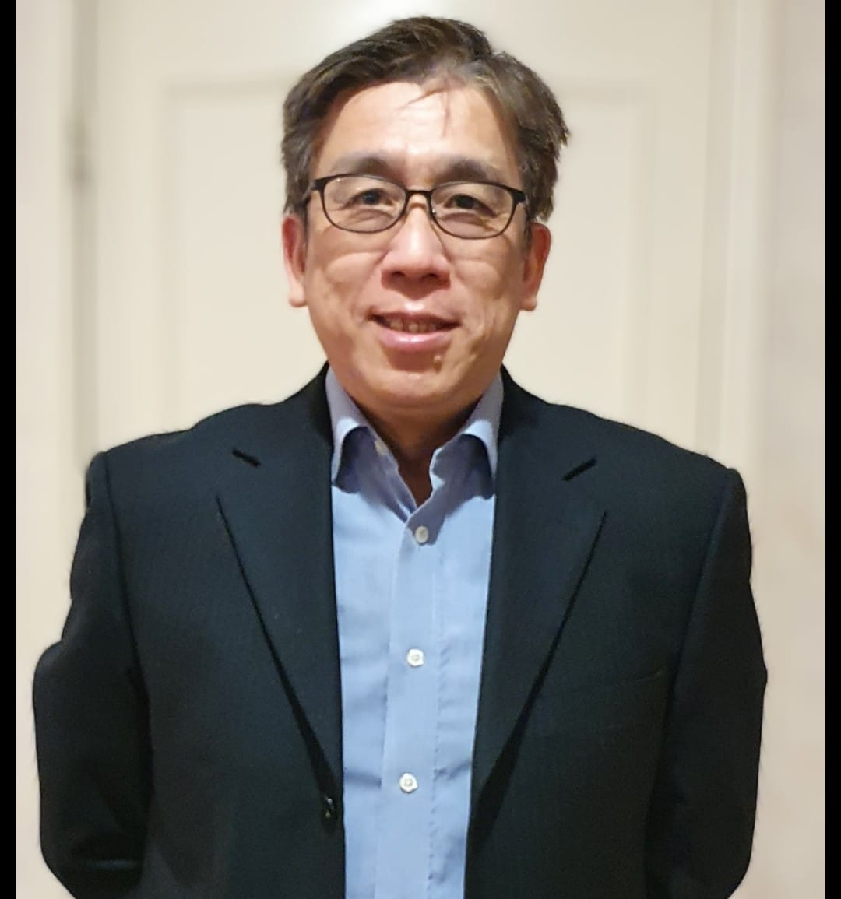
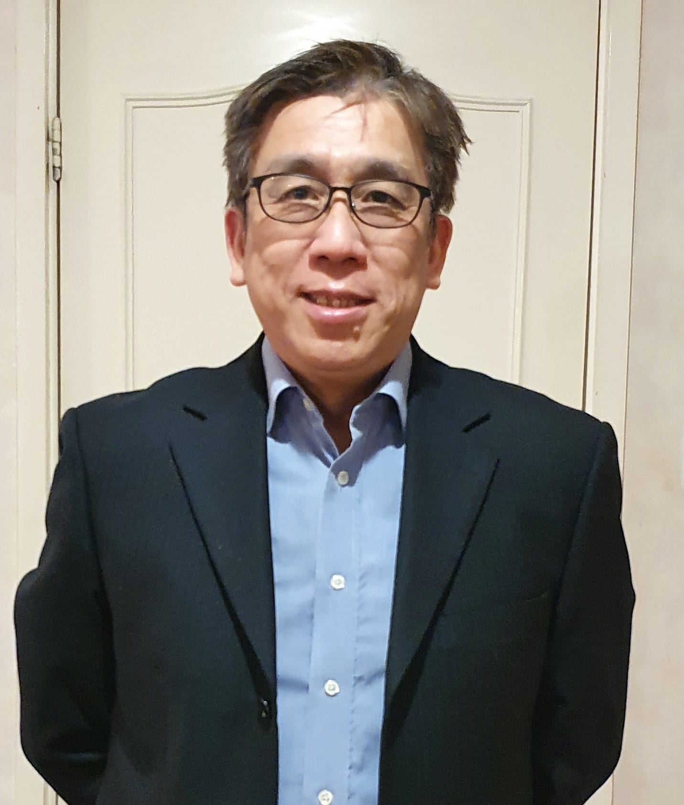

# 陈马平牧师 Rev. Aaron Chan

## 简介
以琳全备福音教会主任牧师，教会创始人之一

## 嘉宾介绍
带职事奉教会有34年。神学毕业于英国 Regents Theological College 硕士学位。
曾在多家跨国航天企业工作，资历超过33年，
飞机电力系统安全专家，英国注册特许工程师。
除了带领教会，他特别喜欢帮助信徒认识圣灵、恩膏，医治等圣经教导。 
他也热衷于教会领导，在教会中培训许多领袖。

[//]: # (photos)

