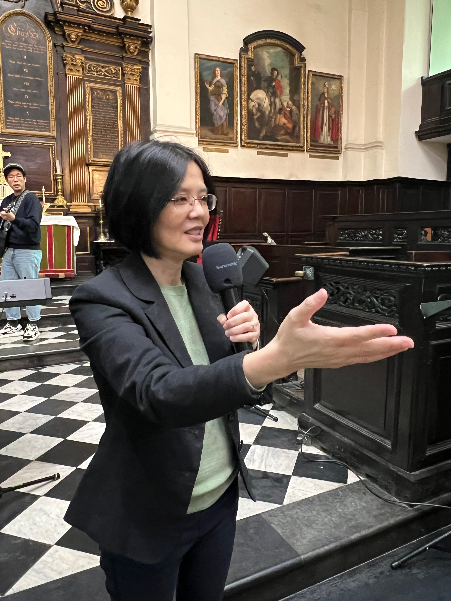

# 刘文丽牧师（师母） Rev. Anna Chan

## 简介
英国以琳全被福音教会主任牧师

## 嘉宾介绍
以琳全备福音教会创办成员之一，
毕业于以琳 Regents Theological College 神学硕士学位。
1988年开始服事教会各方面事工，
如圣经教导、门徒培训、关顾辅导、讲道、植堂、宣教、音乐、青年人等等。
由于对圣经学习有着浓厚兴趣，得到圣经学者 Keith Warrington 博士鼓励，
现致力于圣经教导工作，希望培训和鼓励华人基督徒对圣经有更深度的认识，看见“铁磨铁，磨出刃来”。

[//]: # (photos)

