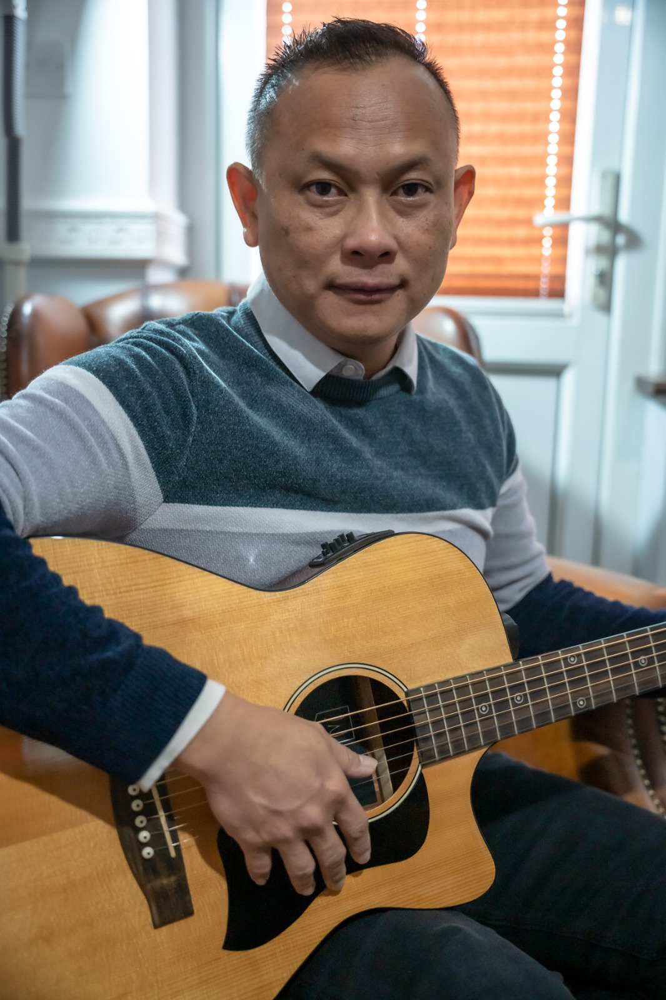

# 罗俊辉 Daniel Leo

## 简介
资深的敬拜赞美乐团导师

## 嘉宾介绍
在教会带领敬拜服事，以及音乐教学培训长达近30年。
Daniel 老师精通钢琴、电子琴、吉他、贝斯、鼓等乐器，
并持有 Yamaha，Rock School，LCM 及 Trinity 专业音乐文凭，
同时深入敬拜乐团培训与编排，曾多次受邀到
新加坡、台湾、印尼、中国大陆、澳洲和欧洲各国参与敬拜服事和培训。

[//]: # (photos)

